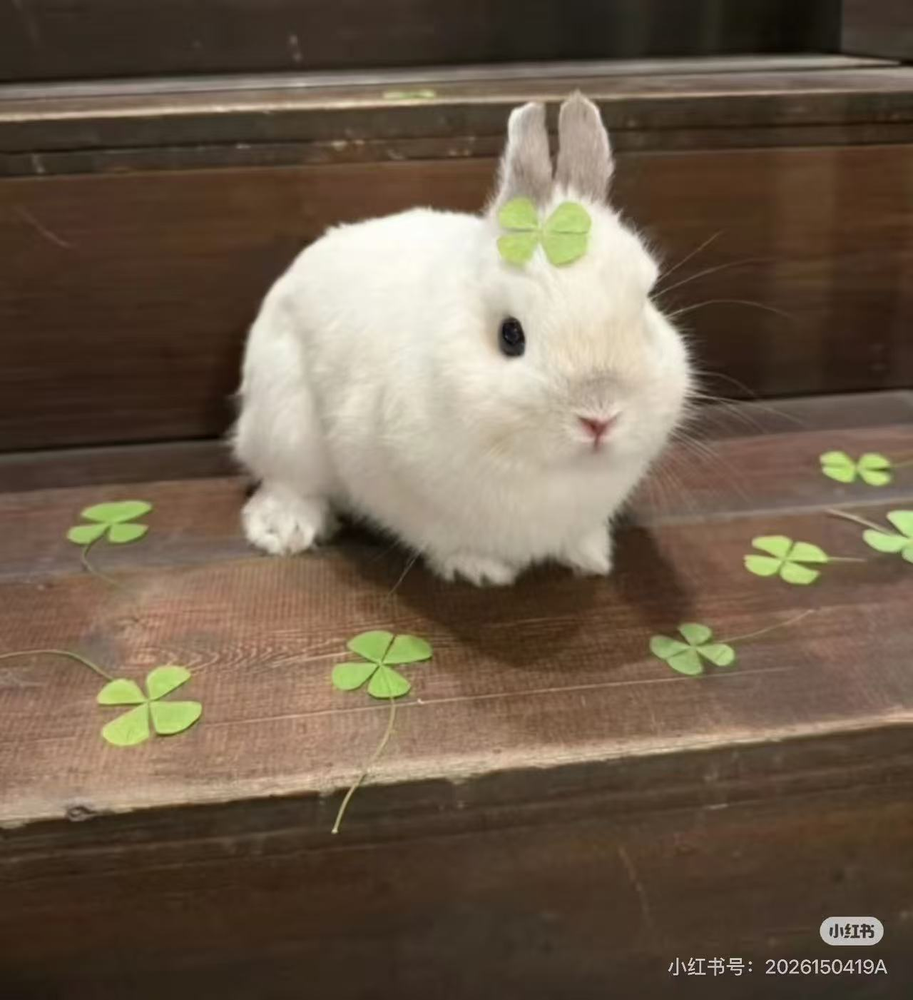
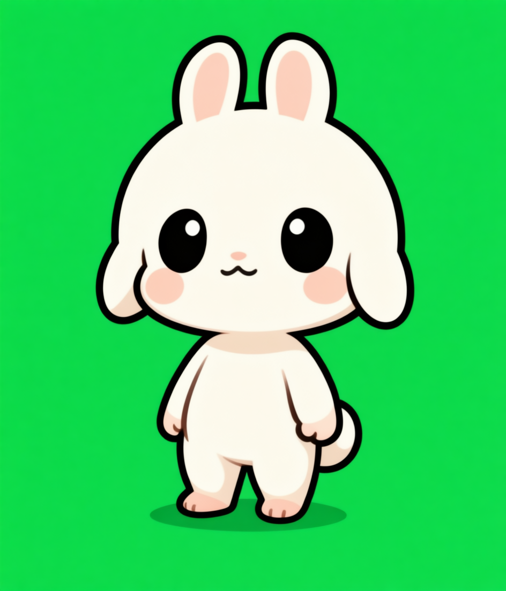
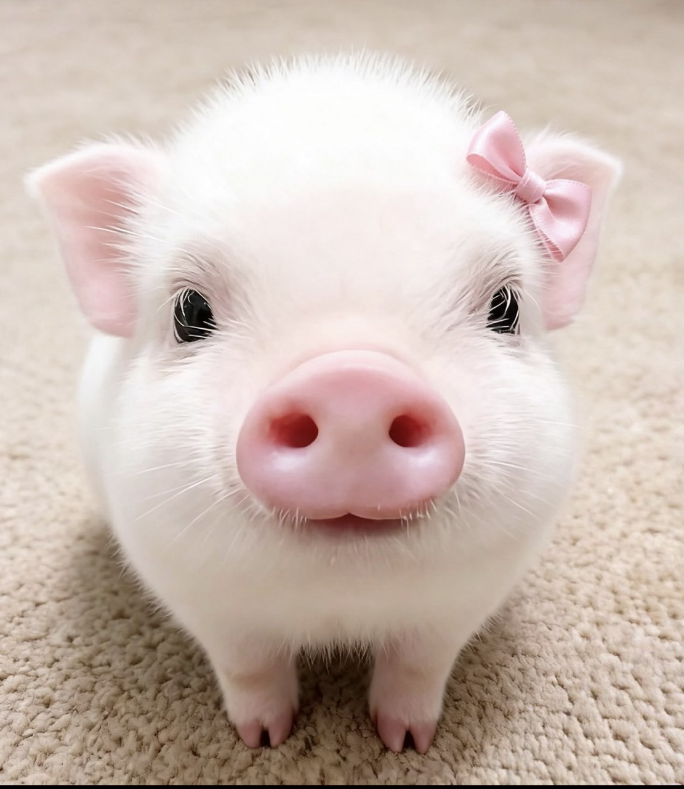
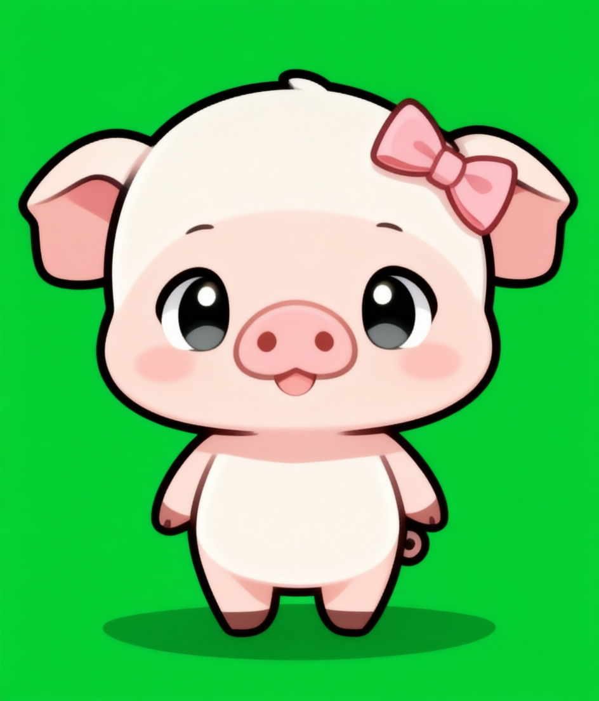

# DGX Spark Desktop Pet Agent

<p align="center"><a href="README.md">English</a> · <a href="README.zh-CN.md">简体中文</a></p>
<p align="center"><strong>Turn a photo into a cute, animated and conversational desktop companion.</strong></p>
<p align="center">NVIDIA DGX Spark · Qwen · Wan 2.2 · ComfyUI · PySide6</p>
<p align="center"></p>

## From a photo to a living desktop pet

The agent sends a reference image to DGX Spark. Qwen Image Edit creates a
consistent chibi character, Wan 2.2 generates its motion, and the post-processing
pipeline produces transparent looping GIF/APNG assets for the macOS desktop pet.

<table>
  <tr><th align="center">Reference photo</th><th align="center">Qwen character design</th></tr>
  <tr>
    <td align="center"></td>
    <td align="center"></td>
  </tr>
</table>

## Three generated action loops

Each action is generated independently and selected as the pet's state changes.
These demos are 320×320, 12 FPS, 61 frames, and about five seconds per loop.

| Eat | Sleep | Yawn |
|:---:|:---:|:---:|
|  |  |  |
| [Original Wan video](docs/assets/demo-dog/eat.mp4) | [Original Wan video](docs/assets/demo-dog/sleep.mp4) | [Original Wan video](docs/assets/demo-dog/yawn.mp4) |

## More generated companions

The same photo-to-pet pipeline works across different character identities and
preserves recognizable features such as ears, colors and accessories.

### Rabbit companion

<table>
  <tr><th align="center">Reference photo</th><th align="center">Generated character</th></tr>
  <tr>
    <td align="center"></td>
    <td align="center"></td>
  </tr>
</table>

| Eat | Sleep | Yawn |
|:---:|:---:|:---:|
|  |  |  |
| [Wan video](docs/assets/demo-rabbit/eat.mp4) | [Wan video](docs/assets/demo-rabbit/sleep.mp4) | [Wan video](docs/assets/demo-rabbit/yawn.mp4) |

### Pig companion

<table>
  <tr><th align="center">Reference photo</th><th align="center">Generated character</th></tr>
  <tr>
    <td align="center"></td>
    <td align="center"></td>
  </tr>
</table>

| Eat | Sleep | Yawn |
|:---:|:---:|:---:|
|  |  |  |
| [Wan video](docs/assets/demo-pig/eat.mp4) | [Wan video](docs/assets/demo-pig/sleep.mp4) | [Wan video](docs/assets/demo-pig/yawn.mp4) |

## What makes it an agent

- **Local conversation:** Qwen3-4B runs on DGX Spark and gives the pet a Chinese-speaking personality.
- **Visual creation:** upload a photo and description to generate a character and three motion loops.
- **Stateful behavior:** conversation, mouse interaction and commands switch the pet between actions.
- **Safe computer tools:** it can propose opening an approved folder, application or user-selected file on the Mac.
- **Human confirmation:** local tools are allowlisted and require confirmation before execution.
- **Private connection:** Spark services stay on loopback and are reached through an SSH tunnel.

## Architecture

```text
macOS PySide6 desktop pet
  ├─ transparent always-on-top window
  ├─ mouse interaction, chat and confirmations
  └─ allowlisted local tools
             │ SSH tunnel :7000
             ▼
DGX Spark agent API
  ├─ Qwen3-4B conversation and tool planning
  ├─ Qwen Image Edit character generation
  ├─ Wan 2.2 image-to-video generation
  └─ FFmpeg/Pillow transparent GIF/APNG pipeline
             │ localhost :8188
             ▼
          ComfyUI
```

The DGX cannot directly operate the Mac. It returns a structured tool proposal;
the macOS client validates it, asks the user, and only then executes an
allowlisted local action.

## Repository contents

```text
desktop_pet_agent/
  mac_client/            # PySide6 macOS companion
  spark_agent/           # chat, state, generation and HTTP API
  tests/                 # unit tests
  workflows/             # exported ComfyUI API workflows
docs/assets/             # dog, rabbit and pig generation demos
output/red-scarf-cat-final/
                         # small fallback animation set
skills/desktop-sprite-generator/
                         # reusable transparent sprite generation Skill
```

Model weights, virtual environments, private connection details, API keys and
generated job history are intentionally excluded.

## Requirements

- NVIDIA DGX Spark or another Linux NVIDIA CUDA host
- Python 3.12 with CUDA-enabled PyTorch and Transformers
- Qwen3-4B for conversation
- ComfyUI with Qwen Image Edit and Wan 2.2 models/nodes
- FFmpeg and Pillow
- macOS with Python 3.9+ and PySide6

## Quick start

### 1. Download the chat model on Spark

```bash
python -m pip install -U modelscope transformers
modelscope download --model Qwen/Qwen3-4B \
  --local_dir "$HOME/model-download/Qwen3-4B"
```

The model is about 8 GB and is not stored in this repository.

### 2. Start the Spark agent

```bash
python -m desktop_pet_agent.spark_agent.server \
  --host 127.0.0.1 \
  --port 7000 \
  --asset-dir "$PWD/output/red-scarf-cat-final" \
  --chat-model "$HOME/model-download/Qwen3-4B"
```

ComfyUI must listen on `127.0.0.1:8188` for generation. Chat and the bundled
fallback animations work without ComfyUI.

### 3. Create the SSH tunnel from the Mac

```bash
ssh -N \
  -o ServerAliveInterval=60 \
  -o ServerAliveCountMax=5 \
  -L 7000:127.0.0.1:7000 \
  -p <SSH_PORT> <SPARK_USER>@<SPARK_HOST>
```

Keep this terminal open and do not expose port 7000 directly to the internet.

### 4. Start the macOS client

```bash
python3 -m venv .venv-mac
.venv-mac/bin/python -m pip install -r desktop_pet_agent/requirements-mac.txt
.venv-mac/bin/python desktop_pet_agent/mac_client/main.py
```

Controls: drag to move, click to poke, double-click to cycle actions, and
right-click to chat, generate a pet, select an action, reset or quit.

Try saying `帮我打开下载文件夹`. The Mac asks for confirmation before acting.

## Generation pipeline

1. The client uploads a reference image and description.
2. Qwen Image Edit creates a full-body character on chroma green.
3. Wan 2.2 creates separate video loops for yawn, sleep and eat.
4. FFmpeg extracts frames.
5. The pipeline removes green and writes transparent APNG/GIF files.
6. The server activates the manifest only after all actions succeed.

Workflow JSON files reference model filenames; model weights are not committed.

## Tests

```bash
python3 -m unittest discover -s desktop_pet_agent/tests -v
```

## Safety

This is a hackathon MVP, not a general-purpose remote administration service.
See [SECURITY.md](SECURITY.md). Keep the API loopback-only and retain
confirmation around local tools.

## License

Code is available under the MIT License. Model weights retain their upstream
licenses. Pet media is included as a generated project demonstration.
